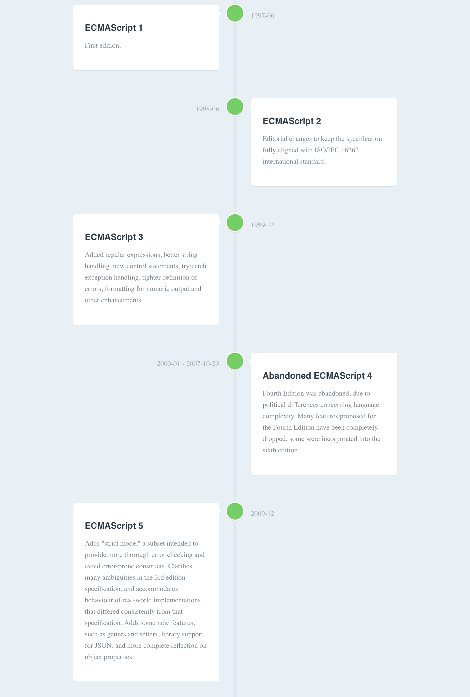

# mdline [](https://travis-ci.org/textlint/textlint)

Markdown timeline format and toolkit.

For example, mdline convert [a markdown file](packages/mdline-parser/test/snapshots/ecmascript/input.md) to following HTML file.

[](https://mdline.netlify.com/)

> [ECMAScript - Wikipedia](https://en.wikipedia.org/wiki/ECMAScript)

## Install

Install with [npm](https://www.npmjs.com/):

    npm install mdline

## Mdline Format

```
## \d{4}-\d{2}-\d{2}: TITLE

MARKDOWN BODY

## \d{4}-\d{2}-\d{2}--\d{4}-\d{2}-\d{2}: TITLE

MARKDOWN BODY
```

**Example:**

```
## 2011-01-16--2011-01-20: Date Ranges

What is happened?

## 2012-01-24: OK

OK
```

For more details, see [ECMAScript timeline example](packages/mdline-parser/test/snapshots/ecmascript/input.md)

## Usage

Convert mdline format text to html.

    npx mdline ./timeline.md -o timeline.html

For more details, see [mdline package](./packages/mdline).

## Changelog

See [Releases page](https://github.com/azu/mdline/releases).

## Running tests

    yarn install
    yarn bootrap
    yarn test

## Contributing

Pull requests and stars are always welcome.

For bugs and feature requests, [please create an issue](https://github.com/azu/mdline/issues).

1. Fork it!
2. Create your feature branch: `git checkout -b my-new-feature`
3. Commit your changes: `git commit -am 'Add some feature'`
4. Push to the branch: `git push origin my-new-feature`
5. Submit a pull request :D

## Author

- [github/azu](https://github.com/azu)
- [twitter/azu_re](https://twitter.com/azu_re)

## License

MIT © azu
